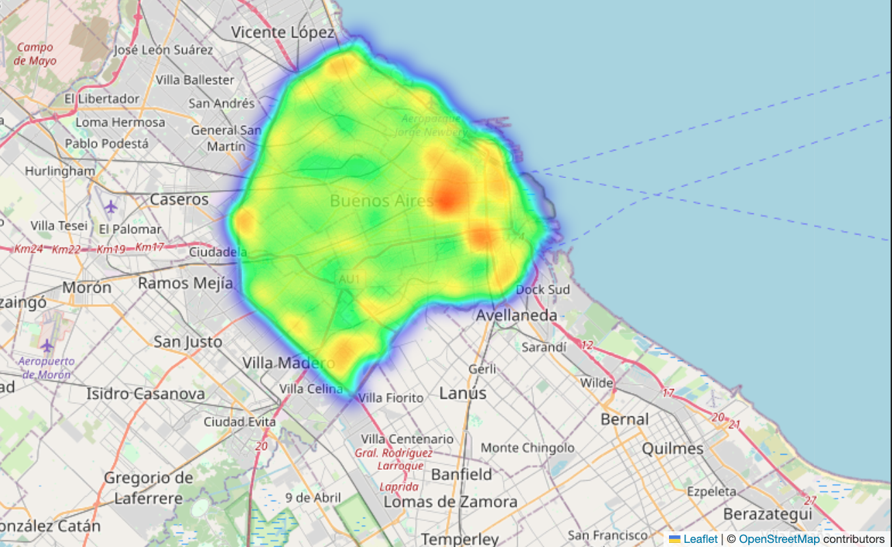

# Crime Prediction

## Índice
1. [Introducción](#introducción)
2. [Objetivo](#objetivo)
3. [Metodología](#metodología)
4. [Datos](#datos)
5. [Visualización en PowerBI](#visualización-en-powerbi)
6. [Herramientas utilizadas en el proyecto](#herramientas-utilizadas-en-el-proyecto)
7. [Contacto](#contacto)

## Introducción
### El Problema

Imagina que eres el responsable de una aseguradora. Todos los días enfrentas el reto de ofrecer productos competitivos y efectivos, mientras gestionas el riesgo y las necesidades de tus clientes. Sin embargo, hay un problema constante que afecta tanto a las aseguradoras como a los asegurados: el robo de autos.

En la Ciudad Autónoma de Buenos Aires (CABA), los delitos relacionados con el robo de autos son una de las principales preocupaciones. Los patrones de robo están en constante cambio, y las aseguradoras deben ser ágiles y rápidas para adaptarse a estos cambios. Sin embargo, muchas pólizas no reflejan de manera efectiva la realidad delictiva, lo que aumenta tanto los riesgos para la aseguradora como la insatisfacción de los clientes.

### Análisis de Delitos y Mejora Trimestral

Aquí es donde entra en juego nuestro MVP: una plataforma de análisis predictivo de delitos en CABA.

A través de la recolección y el análisis de datos sobre las zonas con mayor incidencia delictiva, patrones de robo y otras variables, nuestro sistema utiliza historias de datos del año anterior para ofrecer una predicción precisa de los posibles eventos delictivos en el siguiente trimestre.

En lugar de proporcionar informes detallados cada tres meses, el sistema analiza los datos del mismo período del año anterior y genera una predicción informada sobre los riesgos de robo en las diferentes zonas de la ciudad. Esta predicción se utiliza para ajustar las pólizas de forma proactiva, con una visión anticipada de los riesgos más probables. Esto permite que las aseguradoras ajusten sus productos de manera continua y se mantengan siempre un paso adelante.

### Beneficios para las Aseguradoras y los Clientes

**Para las aseguradoras:**
- **Reducción de riesgos:** Las pólizas se ajustan a la predicción de riesgos, reduciendo la exposición de la aseguradora a posibles pérdidas inesperadas.
- **Mejora en competitividad:** Al tener acceso a un análisis predictivo, las aseguradoras pueden ofrecer productos más personalizados y ajustados a las tendencias delictivas.
- **Optimización de recursos:** Los datos predictivos permiten que las aseguradoras estén siempre preparadas para reaccionar ante cambios en el entorno delictivo, sin necesidad de realizar ajustes reactivos.

**Para los clientes:**
- **Cobertura más precisa:** Los clientes reciben una póliza ajustada a las predicciones de riesgo, lo que resulta en precios más justos y una cobertura más adecuada a su realidad.
- **Confianza en su aseguradora:** Saber que la póliza está basada en un análisis predictivo aumenta la confianza en la aseguradora, ya que sienten que su seguro está siempre alineado con el contexto delictivo actual.
- **Mejora en la experiencia del cliente:** Los asegurados perciben que su aseguradora está comprometida con ofrecerles productos adaptados a la situación real.

### El Futuro de las Pólizas

Gracias a nuestro enfoque innovador, las aseguradoras pueden anticiparse a los cambios en el entorno delictivo y ofrecer productos que no solo protejan a los clientes, sino que también generen mayor confianza y satisfacción.

El futuro de las pólizas de seguros es dinámico, inteligente y, lo más importante, basado en predicciones de datos reales. Así, las aseguradoras estarán preparadas para enfrentar los desafíos de una forma más eficiente y proactiva.

## Objetivo
El objetivo principal de este proyecto es desarrollar un modelo de predicción basado en datos históricos de crímenes, utilizando técnicas de Machine Learning y herramientas de visualización para facilitar la toma de decisiones en materia de seguridad.

## Metodología
1. Recolección y limpieza de datos.
2. Análisis exploratorio de datos (EDA).
3. Creación de visualizaciones interactivas con PowerBI.
4. Desarrollo y evaluación de modelos de Machine Learning.

## Datos
El dataset utilizado en este proyecto contiene información sobre delitos ocurridos en Buenos Aires en 2021. Las variables incluyen:
- Fecha y hora del delito.
- Tipo de delito (homicidio, robo, hurto, lesiones, etc.).
- Ubicación del delito.
- Otras características relevantes para el análisis.

## Visualización en PowerBI
Se ha desarrollado dashboards en Power BI en el que podemos observar gráficos sobre los robos de autos en las diferentes comunas de Buenos Aires a distintas horas del día.

## Herramientas utilizadas en el proyecto
| Herramienta | Logo | Descripción |
|------------|------|-------------|
| Python | 🐍 | Lenguaje de programación principal para el procesamiento de datos. |
| Pandas | 📊 | Librería para manipulación y análisis de datos. |
| NumPy | 🔢 | Librería para operaciones numéricas y manejo de matrices. |
| Matplotlib | 📈 | Biblioteca para la generación de gráficos estáticos, animados e interactivos. |
| Seaborn | 🎨 | Herramienta para la visualización de datos basada en Matplotlib. |
| Scikit-learn | 🤖 | Librería de Machine Learning para la creación de modelos predictivos. |
| Power BI | 📊 | Herramienta de visualización de datos y creación de dashboards. |
| Jupyter Notebook | 📓 | Entorno interactivo para el desarrollo y documentación del análisis. |
| GitHub | 🛠️ | Plataforma para el control de versiones y colaboración en el proyecto. |
| Notion | 📝 | Herramienta de gestión de proyectos y documentación colaborativa. |

## Contacto
Si tienes alguna pregunta o deseas contribuir al proyecto, puedes contactarnos a través de:

| Integrantes | Rol | GitHub | LinkedIn |
|------------|-----|--------|---------|
| Camila Duran | Data Scientist | [GitHub](https://github.com/Camila20197) | [LinkedIn](https://www.linkedin.com/in/camila-ayelen-durand-6b9209221/) |
| Nicolas Boniface | Data Analyst | [GitHub](https://github.com/Nicobonigit) | [LinkedIn](https://www.linkedin.com/in/nicolas-boniface-10b083112/) |
| Nathaly Gaibor | Data Analyst | [GitHub](https://github.com/NathalyGC) | [LinkedIn](https://www.linkedin.com/in/nico-boniface-7052b7232/) |

---
¡Gracias por visitar este repositorio! 😊

